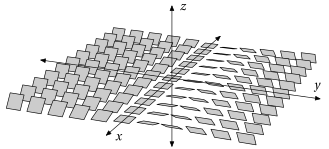

In this post we are going to study the well known beautiful correspondence that exists between flat connections and representations of the fundamental group, sometimes called the "Riemann-Hilbert correspondence". This is a very rich result in that it draws together several fields of Mathematics and leads to new interesting problems like the study of certain moduli spaces or the relations with Yang-Mills equations. Moreover, this correspondence is the first step to fully understand another very interesting correspondence known as the Nonabelian Hodge Theorem.

Writing this post has been challenging for me, I thought it would take me just a couple of days and it turns out I needed a whole week (and it is shorter than the previous one!). Luckily, this process has helped get a deeper understanding of the things I already knew and also learn a lot of new things. For example, now I understand way better the Frobenius theorem, gauge transformations, and the relationship between connections in vector bundles and connections in principal bundles. 

As usual, most of this material is well known and found elsewhere, although I think this topic in particular is not very well explained in the common references. I hope that this post helps people understand all this much better, as it has helped me writing it.

 In my [last post](https://guillegallego.xyz/blog/Monodromy/monodromy.html) we already gave a correspondence between representations of the fundamental group and covering spaces, so we are going to prove the correspondence by relating flat connections to covering spaces (also called *local systems* in this context). 

With this point of view, a general proof of the correspondence can be given by using the Frobenius theorem. We are going to sketch this proof, but I prefer to study in detail the proof for matrix groups, which uses a more "classical version" of Frobenius, is more explicit, and maybe fits better with the "cocycle approach" that I have been maintaining in my previous posts.

# The Frobenius theorem
As with many other results in Mathematics, the main fact that lies behind this correspondence is an existence theorem for solutions of a differential equation. In differential geometry, one of the most common "existence theorems" is the integrability theorem of Frobenius. 

The most elementary, yet complete version of the Frobenius theorem (at least from the local point of view) is the following, which I like to call the "analysts version" of Frobenius (rather, it is the "classical version" of the theorem):

**Theorem**. *Let $U\times V \subset \mathbb{R}^m \times \mathbb{R}^n$ be open, where $U$ is a neighborhood of $0\in \mathbb{R}^m$, and let $F_i: U \times V \rightarrow \mathbb{R}^n$ be $C^\infty$ functions, for $i=1,...,m$. Then for every $x\in V$, there exists one and only one smooth function*

$$
\alpha: W\rightarrow V,
$$
*defined in a neighborhood $W$ of $0$ in $\mathbb{R}^n$, satisfying*

\begin{align*}
\alpha(0) &=x \\
\frac{\partial \alpha}{\partial t^i} (t) &= F_i (t,\alpha(t)), \text{ for all } t\in W,
\end{align*}

*if and only if there is a neighborhood of $(0,x) \in U \times V$ on which*

$$
\frac{\partial F_j}{\partial t^i} - \frac{\partial F_i}{\partial t^j} + \sum_{k=1}^n \frac{\partial F_j}{\partial x^k} F_i^k -\sum_{k=1}^n \frac{\partial F_i}{\partial x^k} F_j^k = 0,
$$

*for $i,j = 1,...,m$.*

We say that this last condition is the *integrability condition* for the PDE above. The proof of this theorem is written in the Dark Tongue of Analysis, which I will not utter here. As many other results, this theorem is based in the existence theorem for ODEs. You can read the proof in [Spivak's wonderful book](http://strangebeautiful.com/other-texts/spivak-intro-diff-geom-v1-3ed.pdf) (Theorem 1 in Chapter 6).

The "geometers version" (or rather, the "modern version") of the Frobenius theorem is stated in the language of distributions. A distribution over some manifold $M$ of dimension $n$ is simply a rank $k$ subbundle $D \subset TM$, for $k<n$. We say that a distribution $D$ is *involutive* if, for any two sections of it (that is, for any two vector fields $X,Y$ that lie in $D$) their Lie bracket $[X,Y]$ also lies in $D$. On the other hand, we say that a distribution is *integrable* if there exists some submanifold $N \subset M$ such that, for any point $x\in N$, $T_xN = D_x$. In that case, we say that $N$ is an *integral manifold* of $D$.

Here you can see an example of a non-integrable distribution in $\mathbb{R}^3$ (this is also the secret handshake of the contact geometers at your department):

{#id .class width=50% height=50%}

The theorem of Frobenius in this geometric context states that any distribution is involutive if and only if it is integrable.

We can now use the classical version to sketch a proof of this fact. We can work locally, so suppose that $M=\mathbb{R}^{m+n}$ and that our distribution has rank $m$. We can see our distribution as $m$ linearly independent vector fields $X_1,...,X_m$ on $\mathbb{R}^{m+n}$ and, by an appropriate choice of coordinates $(t,x)$, we can write these fields as

$$
X_i= \frac{\partial}{\partial t^i} + \sum_{k=1}^n X_i^k \frac{\partial}{\partial x^k}.
$$

A rather tedious computation yields

$$
[X_i,X_j] = \left( \frac{\partial X_j^s}{\partial t^i} - \frac{\partial X_i^s}{\partial t^j} + \sum_{k=1}^n X_i^k \frac{\partial X_j^s}{\partial x^k} - \sum_{k=1}^n X_j^k \frac{\partial X_i^s}{\partial x^k}  \right) \frac{\partial}{\partial x^s}.
$$
Therefore, the distribution is involutive if and only if, for every $s=1,...,n$, we have

$$
\frac{\partial X_j^s}{\partial t^i} - \frac{\partial X_i^s}{\partial t^j} + \sum_{k=1}^n X_i^k \frac{\partial X_j^s}{\partial x^k} - \sum_{k=1}^n X_j^k \frac{\partial X_i^s}{\partial x^k}=0.
$$

Does this look familiar? 

By writing $F_i = \sum_{s=1}^n X_i^s \frac{\partial}{\partial x^s}$, we have that the above expression is the integrability condition for the PDE

$$
\frac{\partial \alpha}{\partial t^i} (t) = F_i(t,\alpha(t))
$$

for $\alpha: U \rightarrow \mathbb{R}^n$ and some open set $U\subset \mathbb{R}^m$. If we call $\varphi=(\mathrm{id},\alpha):U \rightarrow U\times \mathbb{R}^n$, the set of points $N=\varphi(U)=\{(t,\alpha(t)) \in \mathbb{R}^{m+n} : t \in U\}$ forms a smooth submanifold of $\mathbb{R}^{m+n}$ with tangent vectors

$$
\varphi_* \left( \left. \frac{\partial}{\partial t^i} \right|_t \right) = \left. \frac{\partial}{\partial t^i} \right|_{(t,\alpha(t))} + \frac{\partial \alpha}{\partial t^i} (t) =\left. \frac{\partial}{\partial t^i} \right|_{(t,\alpha(t))} + F_i(t,\alpha(t)) = X_i.
$$

Therefore, $N$ is an integral manifold of our distribution.

# Principal bundles and local systems
During all this post we will be using the notions from my [post on torsors and cocycles](https://guillegallego.xyz/blog/Torsors/torsors.html), and also we will make use of the correspondence between covering spaces and representations that I gave in my [last post](https://guillegallego.xyz/blog/Monodromy/monodromy.html).

Let me recall that for $X$ a topological space and $\mathcal{G}$ a sheaf of groups over $X$, a $\mathcal{G}$ torsor is a sheaf of sets on $X$ with nonempty stalks which is endowed with a free and transitive action of $\mathcal{G}$. What we saw in my [post on torsors and cocycles](https://guillegallego.xyz/blog/Torsors/torsors.html) is that the functor that sends every $\mathcal{G}$-torsor to its set of transition functions gives an equivalence of categories between the category of $\mathcal{G}$-torsors and the action groupoid $[Z^1(X,\mathcal{G}),C^0(X,\mathcal{G})]$, where these two sets denote the sets of equivalence classes by refinement of pairs $(\mathfrak{U},f)$, with $\mathfrak{U}$ an open cover of $X$ and $f$ a Čech $1$-cocycle (a Čech $0$-cochain, respectively).

For our purposes, we will fix now once and for all $X$ a smooth manifold and $G$ a Lie group, and consider the sheaves $G$, which maps any open set $U\subset X$ to the group $C^\infty(U,G)$ of $G$-valued smooth functions, and $\underline{G}$, which maps any open set $U\subset X$ to the group of locally constant functions $U\rightarrow G$.

We will call a $G$-torsor on $X$ a *principal $G$-bundle* over $X$, and we will call a $\underline{G}$-torsor on $X$ a *$G$-local system* over $X$.

Recall that in my [last post](https://guillegallego.xyz/blog/Monodromy/monodromy.html) we called elements of $Z^1(\mathfrak{U},\underline{G})$ by the name of $\mathfrak{U}$-based $G$-covering spaces. Therefore, a $G$-local system is an equivalence class by refinement of $G$-coverings. In that post we also proved the *monodromy theorem* which said that the groupoid $[Z^1(\mathfrak{U},\underline{G}),C^0(\mathfrak{U},\underline{G})]$ was equivalent to the groupoid $[\mathrm{Hom}(\pi_1(X,x_0),G),G]$ of $G$-representations of the fundamental group with the conjugation action, which we called the *Betti groupoid*, $\mathfrak{U}$ being an open cover satisfying certain "good" topological conditions. Since we are on a smooth manifold, every open cover can be refined to one that is "good" in that sense, and thus we get an equivalence between the category of $G$-local systems and the Betti groupoid. In particular, the *Betti moduli set* $\mathcal{M}_B(G) = \mathrm{Hom}(\pi_1(X,x_0),G)/G$ parametrizes isomorphism classes of $G$-local systems.

The purpose of this post is to prove that the category of $G$-local systems is equivalent to another "differential geometric" category, the category of *flat bundles*. As a consequence, this equivalence will yield an equivalence between this category of flat bundles and the Betti groupoid.

# Vector bundles
We will start by proving this equivalence for vector bundles, so we better define what these are.

Consider the *sheaf of smooth complex-valued functions* $C^\infty_X$ on $X$ sending every open set $U\subset X$ to the set $C^\infty(U,\mathbb{C})$. A *sheaf of $C^\infty_X$-modules* is a sheaf of abelian groups $E$ on $X$ such that, on any $U\subset X$, the group $E(U)$ is a $C^\infty_X(U)$-module and such that the restriction homomorphisms $E(V) \rightarrow E(U)$ are $C^\infty_X(U)$-linear.

A *complex vector bundle of rank $n$ on $X$* is a locally free sheaf $E$ of $C^\infty_X$ modules. This means that there exist an open cover $\mathfrak{U}$ of $X$ and isomorphisms $\varphi_U: E|_U \rightarrow C^\infty_X|_U ^n$ for every $U \in X$. The pair $(\mathfrak{U},\varphi)$, with $\varphi=\{\varphi_U\}_{U\in \mathfrak{U}}$ is called a *trivialization* of $E$.

To any rank $n$ complex vector bundle $E$, fixing a trivialization $(\mathfrak{U},\varphi)$, we can associate its set of transition functions $g_{UV}:U \cap V \rightarrow \mathrm{GL}(n,\mathbb{C})$, defined as 

$$
g_{UV}=\varphi_V|_{U\cap V} \circ \varphi_U^{-1}|_{U\cap V},
$$

for $U,V \in \mathfrak{U}$, $U\cap V \neq \varnothing$. Clearly the $g_{UV}$ define a cocycle, so we get a map

$$
\{ \text{Rank $n$ vector bundles} \} \longrightarrow Z^1(\mathfrak{U},\mathrm{GL}(n,\mathbb{C})).
$$

A *gauge transformation* between two vector bundles $E_1$ and $E_2$ is a $C^\infty_X$-linear sheaf isomorphism $\xi:E_1\rightarrow E_2$. Fixing trivializations $(\mathfrak{U},\varphi_1)$ and $(\mathfrak{U},\varphi_2)$ of $E_1$ and $E_2$ with the same trivializing open cover, to any gauge transformation $\xi$ we can associate the element $f\in C^0(\mathfrak{U},\mathrm{GL}(n,\mathbb{C}))$ defined as

$$
f_U=\varphi_{2,U} \circ \xi|_U \circ \varphi_{1,U}^{-1},
$$

for $U\in \mathfrak{U}$.

Thus, if we denote by $\mathbf{Vect}_n$ the category whose objects are vector bundles on $X$ of rank $n$ and where morphisms are given by gauge transformations, by making a choice of trivialization on any vector bundle, we have defined a functor

$$
\mathbf{Vect}_n \longrightarrow [Z^1(X,\mathrm{GL}(n,\mathbb{C})), C^0(X,\mathrm{GL}(n,\mathbb{C}))].
$$

This functor is fully faithful. Fix $E_1$ and $E_2$ vector bundle with trivializations $(\mathfrak{U},\varphi_1)$ and $(\mathfrak{U},\varphi_2)$. Clearly, the map $\xi\mapsto f$, with $f$ defined as above gives a bijection between gauge transformations and elements of $C^0(\mathfrak{U},\mathrm{GL}(n,\mathbb{C}))$.

This functor is essentially surjective. Let $(\mathfrak{U},g)$, with $g \in Z^1(\mathfrak{U},\mathrm{GL}(n,\mathbb{C}))$, be a pair representing an element of $Z^1(X,\mathrm{GL}(n,\mathbb{C}))$. The way to recover now the vector bundle is similar to how we recovered a torsor from a cocycle. Define the presheaf

$$
E_g(U)= \coprod_{V \in \mathfrak{U}} C^\infty_X(U\cap V)^n / \sim,
$$

where $f \in C^\infty_X(U\cap V)^n$ and $f' \in C^\infty_X(U\cap V')^n$, with $V\cap V'$ are related by $\sim$ if

$$
f|_{U\cap V \cap V'} = g_{V V'} f'|_{U\cap V \cap V'}.
$$

This presheaf verifies the sheaf condition by construction and it is clearly locally free of rank $n$. If $(\mathfrak{V},\varphi)$ is any trivialization of $E_g$, then it is easy to check that, after passing to a common refinement, its transition functions are on the same orbit by a $0$-cochain as the refinement of the cocycle $g$.

Therefore, the category $\mathbf{Vect}_n$ is equivalent to that of $\mathrm{GL}(n,\mathbb{C})$-torsors (that is, principal $\mathrm{GL}(n,\mathbb{C})$-bundles).

# Connections in vector bundles
Let $E$ be a vector bundle and consider the bundles $\Omega^k_X$ consisting on complex-valued smooth differential $k$-forms on $X$. For example, $\Omega^1_X$ is the *cotangent bundle* of $X$ (actually, it is the sheaf of sections of the cotangent bundle, but we are already regarding bundles as locally free sheaves).

**Definition**. A *connection* $D$ on $E$ is a $\mathbb{C}$-linear operator

$$
D: E \rightarrow E \otimes \Omega^1_X
$$

such that

$$
D(fs) = sdf + f Ds,
$$

for $f\in C^\infty_X(U)$ and $s\in E(U)$, for every open subset $U\subset X$.

Let $D$ be a connection on a vector bundle $E$ and take an open set $U\in \mathfrak{U}$ in some trivialization $(\mathfrak{U},\varphi)$ of $E$. We define a *frame of $E$ in $U$* to be a basis $\{e_1,...,e_n\}$ of $E(U)$, given that it is a free $C^\infty_X(U)$-module. For any $e_i$ of the frame, the connection acts as

$$
D e_i = \sum_j e_j A^j_i,
$$

for $A^j_i \in \Omega^1_X(U)$. Using matrix notation, regarding $e=(e_i)$ as a row vector and $A=(A^j_i)$ as a square matrix, we get

$$
De= eA.
$$

Now, given any other section $s\in E(U)$, we can write $s=\sum_i s^i e_i$, for $s^i \in C^\infty_X(U)$ and we have

$$
D s = \sum_i (d s^i e_i + s^i D e_i) = \sum_i (ds^i e_i + s^i e_j A^i_j)  = (d+A) s.
$$

The matrix $A$ is called the *connection $1$-form* of $D$ on $U$.

**Definition**. Let $D$ be a connection on a vector bundle $E$. We define the *curvature* of $D$ as the operator

$$
D^2: E \rightarrow E \otimes \Omega^2_X.
$$

The curvature is a $C^\infty_X$-linear map since

$$
D^2(fs)=D(sdf + fDs)=Ds \wedge df + df \wedge Ds + f D^2 s= fD^2 s,
$$

for $s\in E(U)$ and $f \in C^\infty_X(U)$.

Locally, in some trivializing open set, we have

$$
D^2(e)=D(eA) = De \wedge A + edA = e(A\wedge A + dA)=e F_A,
$$

for $F_A= dA + A\wedge A$ a matrix of $2$-forms which we call the *curvature $2$-form*.

Fix $E_1$ and $E_2$ vector bundles and consider $\xi:E_1 \rightarrow E_2$ a gauge transformation. If $D$ is a connection on $E_1$ we can define a connection on $E_2$ as

$$
\xi \cdot D = \xi \circ D \circ \xi^{-1}.
$$

Now, take trivializations $(\mathfrak{U},\varphi_1)$ and $(\mathfrak{U},\varphi_2)$ of $E_1$ and $E_2$ and $f_U= \varphi_{2,U} \circ \xi|_U \circ \varphi_{1,U}^{-1}$. Choose now local frames $e_1$ and $e_2$ of $E_1$ and $E_2$, respectively, on $U$, such that their images through their respective trivializations yield the canonical basis. Consider $A_1$ the connection $1$-form of $D$ in the frame $e_1$. If $A_2$ denotes the connection $1$-form of $(\xi \cdot D)$ in the frame $e_2$, we have

\begin{align*}
e_2 A_2 & = (\xi \cdot D) (e_2) = \xi D(\xi^{-1}(e_2)) = \xi D(e_1 f_U^{-1}) \\ & = \xi (De_1 f_U^{-1} + e_1 df_U^{-1}) = e_2(f_U A_1 f_U^{-1}  + f_U df_U^{-1}),
\end{align*}

so 

$$
A_2 =f_U A_1 f_U^{-1}  + f_U df_U^{-1}.
$$

The curvature of the gauge-transformed connection now is

$$
(\xi \cdot D)^2= \xi \circ D \circ \xi^{-1} \circ \xi \circ D \circ \xi^{-1} = \xi \circ D^2 \circ \xi^{-1}.
$$

Thus, in the frames defined above,

\begin{align*}
e_2 F_{A_2} &= \xi(D^2(\xi^{-1}(e_2))) = \xi D^2(e_1 f_U^{-1}) = \xi D(D(e_1) f_U^{-1} + e_1 df_U^{-1}) \\
&=  \xi (D^2(e_1) f_U^{-1} - D(e_1) \wedge df_U^{-1} + D(e_1) \wedge df_U^{-1} ) \\
& = \xi  D^2(e_1) f_U^{-1} = \xi( e_1 F_{A_2} f_U^{-1})= e_2 f_U F_{A_1} f_U^{-1},
\end{align*}

so 

$$
F_{A_2} = f_U F_{A_1} f_U^{-1}.
$$

# Flat connections
**Definition**. We say that a connection $D$ on a vector bundle $E$ is *flat* if its curvature vanishes, that is, $D^2=0$. A *flat vector bundle* is a pair $(E,D)$, where $E$ is a vector bundle over $X$ and $D$ is a flat connection on $E$.

The formulas above show that if a connection is flat then its gauge transformations are also flat, so *flatness is preserved by gauge transformations*.

We can thus define the category $\mathbf{FlatVect}_n$ whose objects are flat vector bundles of rank $n$ on $X$ and its morphisms are given by gauge transformations. This category is clearly a groupoid, and it is called the *de Rham groupoid*. Its set of equivalence classes $\mathcal{M}_{dR}(\mathrm{GL}(n,\mathbb{C}))$ is called the *de Rham moduli set* of $\mathrm{GL}(n,\mathbb{C})$.

We can now state and prove the main theorem of this post:

**Theorem**. There is an equivalence of groupoids

$$
\mathbf{FlatVect}_n \longrightarrow [Z^1(X,\underline{\mathrm{GL}(n,\mathbb{C})}), C^0(X,\underline{\mathrm{GL}(n,\mathbb{C})})].
$$

In particular, this gives a bijection $\mathcal{M}_{dR}(\mathrm{GL}(n,\mathbb{C})) \cong \mathcal{M}_B(\mathrm{GL}(n,\mathbb{C}))$ between the de Rham and the Betti moduli sets.

*Proof*. More precisely, we want to prove the following.

1. Provided any pair $(E,D)$, where $E$ is a vector bundle of rank $n$ and $D$ is a flat connection on $E$, we have to find an open cover $\mathfrak{U}$ of $X$ and locally constant functions $h_{UV}:U\cap V \rightarrow \mathrm{GL}(n,\mathbb{C})$, for $U,V \in \mathfrak{U}$ and $U\cap V \neq \varnothing$. This allows us to define the functor at the level of objects.

2. If we denote by $\mathrm{Hom}((E_1,D_1),(E_2,D_2))$ the set of gauge transformations between two flat bundles $(E_1,D_1)$ and $(E_2,D_2)$ and by $\mathrm{Hom}(h_1,h_2)$ the set of $0$-cochains relating the two corresponding cocycles $h_1$ and $h_2$, we want to give a bijection $\mathrm{Hom}(D_1,D_2) \rightarrow \mathrm{Hom}(h_1,h_2)$. This would define the functor at the level of morphisms as well as prove that it is fully faithful.

3. Given any pair $(\mathfrak{U},h)$ representing an element of $Z^1(X,\underline{\mathrm{GL}(n,\mathbb{C})})$, we have to construct a flat vector bundle $(E_h,D_h)$ such that the corresponding cocycle $h'$ is equivalent to $h$. This will show that the functor is essentially surjective.

In order to prove 1 we have to find the mentioned locally constant functions $h_{UV}$. Choose $(\mathfrak{U},\varphi)$ a trivialization of $E$. Suppose that we could find, for every $U\in \mathfrak{U}$, a frame $\epsilon_U$ of $E$ in $U$ such that $D \epsilon_U = 0$. Consider as above the frame $e_U$ of $E$ in $U$ defined as the inverse image through $\varphi_U$ of the canonical basis. We have that $e_U$ and $\epsilon_U$ are related by some matrix-valued function $f_U:U \rightarrow \mathrm{GL}(n,\mathbb{C})$, so that $\epsilon_U = e_U f_U$. 

Therefore, if we consider in a nonempty overlap $U\cap V$ the cocycle $h_{UV}= f_V^{-1} g_{UV} f_U$, we have

$$
0 = D \epsilon_U = D (e_U f_U) = D (e_V g_{UV} f_U) = D(\epsilon_V f_V^{-1} g_{UV} f_U) = D(\epsilon_V h_{UV}) = D \epsilon_V h_{UV} + \epsilon_V dh_{UV},
$$

so $dh_{UV}=0$ and $h_{UV}$ is locally constant.

It remains to see then why we can find such a frame $\epsilon_U$. By taking the frame $e_U$ as above, we want to find matrix-valued functions $f_U: U \rightarrow \mathrm{GL}(n,\mathbb{C})$ satisfying

$$
0= D\epsilon_U = D(e_U f_U) = D(e_U) f_U + e_U df_U = e_U (A_U f_U + df_U),
$$

where $A_U$ is the connection $1$-form in the frame $e_U$.

That is, our problem is reduced to that of finding solutions $f$ to the differential equation

$$
df + A f = 0.
$$

We are going to solve this using the "classical form" of the Frobenius theorem. If we denote by $x^\nu$ the coordinates in $X$, we have $A= \sum_\nu A_{\nu} dx^\nu$ and $d f = \sum_\nu \partial_\nu f dx^\nu$. Our differential equation then becomes the following PDE:

$$
\partial_\nu f(x) +f(x) A_{\nu}(x) = 0.
$$

Now, if we write

$$
F_{\nu}(x,y) = - y A_{\nu} (x),
$$

we can regard our equation as

$$
\frac{\partial f}{\partial x^\nu} = F_{\nu} (x, f(x)).
$$

This is a PDE of the kind that appears in the Frobenius theorem, so the integrability condition is

$$
0=\partial_{\nu} F_\mu - \partial_\mu F_\nu + \sum_k \partial_{y^k} F_\mu F^k_{\nu} - \sum_k \partial_{y^k} F_\nu F^k_{\mu} .
$$

But this means precisely

$$
0 = \partial_\nu A_\mu - \partial_\mu A_\nu - \sum_k  A_{k,\mu} A^k_\nu+ \sum_k  A_{k,\nu} A^k_\mu,
$$

which the $dx^\nu \wedge dx^\mu$ component of the form $F_A=dA + A \wedge A$. Since by assumption the connection is flat, the integrability condition is met and solutions exist around any point.

Let us prove 3 now. Take $(\mathfrak{U},h)$ representing an element of $Z^1(X,\underline{\mathrm{GL}(n,\mathbb{C})})$. As above, from $(\mathfrak{U},h)$ we can recover a vector bundle $E_h$ whose transition functions are given precisely by $h$. The connection 1-form $A_U=0$ in any $U \in \mathfrak{U}$ defines a connection on $E_h$ which is trivially flat.

Finally, let us see the proof of 2. Choose trivializations $(\mathfrak{U},\varphi_1)$ and $(\mathfrak{U},\varphi_2)$ of $E_1$ and $E_2$ with the same trivializing cover. Assume that every $U\in \mathfrak{U}$ is connected and choose $x_U$ a point in every $U$. Given any gauge transformation $\xi$, to which we associate a cochain $f\in C^0(\mathfrak{U},\mathrm{GL}(n,\mathbb{C}))$, we can define a cochain $\tilde{f} \in C^0(\mathfrak{U},\underline{\mathrm{GL}(n,\mathbb{C})})$ by choosing $\tilde{f}_U = f_U(x_U)$. This assignation yields a map

$$
\mathrm{Hom}((E_1,D_1),(E_2,D_2)) \rightarrow \mathrm{Hom}(h_1,h_2),
$$

which is trivially surjective, since $C^0(\mathfrak{U},\underline{\mathrm{GL}(n,\mathbb{C})}) \subset C^0(\mathfrak{U},\mathrm{GL}(n,\mathbb{C}))$. 

It remains to prove that this map is injective. Choose $\xi_1$ and $\xi_2$ such that $(\xi_1 \cdot D_1) = (\xi_2 \cdot D_1) = D_2$. Therefore, for $\xi=\xi_1^{-1} \circ \xi_2$, we have $(\xi \cdot D_1) = D_1$. Therefore, if $f$ is the $0$-cochain associated to $\xi$, we have, in $U\in \mathfrak{U}$,

$$
A_U = f_U A_U f_U^{-1} + f_U df_U^{-1}.
$$

Now, if the images of $\xi_1$ and $\xi_2$ coincide we have that $f_{1,U}(x_U) = f_{2,U}(x_U)$ for every $U\in \mathfrak{U}$, so $f_U(x_U) = I$, the identity matrix. Therefore,

$$
A_U (x_U ) = A_U(x_U) + df_U^{-1} (x_U),
$$

so $df_U^{-1}=0$ on $x_U$. Now, maybe by refining the covering $\mathfrak{U}$, we get $f_U = I$ and $f_{1,U} = f_{2,U}$.

This finishes the proof of the theorem. $\blacksquare$

# The correspondence as a de Rham theorem
You might be wondering why is it that we called the category of flat bundles the de Rham groupoid. This comes from considering the rank $1$ vector bundle $E=C^\infty_X$. A connection on this vector bundle is simply an operator $D=C^\infty_X \rightarrow \Omega^1_X$ of the form $D=d+A$, for $A \in \Omega^1(X)$ a $1$-form on $X$. 
Moreover, the connection $D$ is flat if and only if $F_A=dA=0$, since $A\wedge A$ is always $0$. Thus, flat connections on $C^\infty_X$ are identified with closed $1$-forms.

Any other $1$-form $A'$ lies in the same orbit under gauge transformations if it exists some nonzero function $f\in C^\infty(X,\mathbb{C}^*)$ such that

$$
A' = A + f^{-1} df.
$$

If we write $f=e^g$ for some function $g\in C^\infty(X,\mathbb{C})$, we have that $A'=A+dg$. Therefore, gauge equivalence classes of flat connections on $C^\infty_X$ are simply (complex-valued) de Rham cohomology classes on $X$. 

It is easy to check, via Chern-Weil theory (see Chapter I, Section 1, in my [Master's Thesis](https://github.com/guillegran/guillermoTFM/raw/master/guillermoTFM.pdf), that all complex rank $1$ vector bundles are isomorphic, and thus that the set of gauge equivalence classes of flat connections on $C^\infty_X$ is simply the (complex) de Rham cohomology set $\mathcal{M}_{dR}(\mathbb{C}^*)$. What we have just shown is that this set is in bijection with the de Rham cohomology group $H^1_{dR}(X,\mathbb{C})$.

The correspondence between flat connections and local systems gives a bijection between $\mathcal{M}_{dR}(\mathbb{C}^*)$ and the Betti moduli set $\mathcal{M}_B(\mathbb{C}^*)$, which in this case is

$$
\mathrm{Hom}(\pi_1(X),\mathbb{C}^*),
$$

since $\mathbb{C}^*$ is abelian and the conjugation action is trivial. This set is easily shown to be in bijection with the singular cohomology group $H^1(X,\mathbb{C})$. Therefore, our correspondence in this case is just the de Rham theorem (for degree $1$ cohomology):

$$
H^1_{dR}(X,\mathbb{C}) \cong H^1(X,\mathbb{C}).
$$

In the general case, the correspondence between flat connections and local systems can be seen as a "Nonabelian de Rham theorem".

# The correspondence for matrix groups
We have established the correspondence between $G$-flat bundles and $G$-representations of the fundamental group for $G=\mathrm{GL}(n,\mathbb{C})$. We are going to sketch now some of the ideas underlying this same correspondence for a general Lie group $G$. Let us start by considering *groups of complex matrices*, that is, Lie groups $G$ acting on $\mathbb{C}^n$ for some $n$ by multiplication, so that $G\subset \mathrm{GL}(n,\mathbb{C})$.

If $G$ is a group of complex matrices, then the equivalence between rank $n$ vector bundles and principal $\mathrm{GL}(n,\mathbb{C})$-bundles descends to an equivalence between principal $G$-bundles and some rank $n$ vector bundles *with extra structure*, with gauge transformations respecting that structure.

For example, suppose that $G=\mathrm{U}(n)$, the group of $n\times n$ complex matrices $A$ such that $A^\dagger A=I$, where $I$ denotes the identity matrix and $\dagger$ stands for taking transpose and complex-conjugating the entries. These matrices are called *unitary matrices* and $\mathrm{U}(n)$ is the *unitary group*. The unitary matrices are precisely those which preserve the canonical Hermitian product of $\mathbb{C}^n$:

$$
(x_1,...,x_n) \cdot (y_1,...,y_n) = \bar{x}_1 y_1 +...+ \bar{x}_n y_n.
$$

Recall that a *Hermitian product* in a complex vector space $V$ is a mapping $h:V\times V \rightarrow \mathbb{C}$ which is linear on the second component and anti-linear on the first (that is, $h(\lambda u,v) = \bar{\lambda} h(u,v)$), definite positive and such that $h(u,v) = \overline{h(v,u)}$. A *Hermitian structure* on a complex vector bundle $E$ is a smoothly varying Hermitian product $h_x$ on each $E_x$. A pair $(E,h)$ where $E$ is a complex vector bundle and $h$ is a Hermitian structure on $E$ is called a *Hermitian vector bundle*.

If $E$ is the vector bundle associated to a principal $\mathrm{U}(n)$-bundle, since the transition functions are unitary, $E$ will have a canonical Hermitian structure $h$ associated to it. On the other hand, if we consider only gauge transformations that respect Hermitian metrics, we get a category $\mathbf{HermVect}_n$ of Hermitian vector bundles of rank $n$ and an equivalence of categories

$$
\mathbf{HermVect}_n \longrightarrow \text{Principal $\mathrm{U}(n)$-bundles}.
$$

A *Hermitian connection* is a connection respecting the Hermitian metric and in the same way as above we can give an equivalence of categories

$$
\mathbf{FlatHermVect}_n \longrightarrow [Z^1(X,\underline{\mathrm{U}(n)}), C^0(X,\underline{\mathrm{U}(n)})].
$$

The same arguments work for other matrix groups like $\mathrm{O}(n)$ (with Riemannian metrics), for example.

# Connections in principal bundles
Finally, we are going to generalize the correspondence to the setting of a principal $G$-bundle with a general Lie group $G$. In order to do this we are going to leave the "cocycle approach" and work in a more "global" approach, which means that I am going to work with the usual "topological" definitions of principal $G$-bundle and vector bundle. Since I do not want to repeat things that very well known and appear in every textbook, I refer the reader to Wikipedia for these definitions.

Principal $G$-bundles and vector bundles as we know them (that is, as $G$-torsors or as locally free sheaves, respectively) are recovered from the topological definitions by considering their sheaves of sections. The equivalence is completed if we use the usual procedure, that we have already described several times, of "gluing" with transition functions.

Just to make everything clear, in this new approach we change our notation: if we refer to a vector bundle $E$, we mean the topological space, while its sheaf of sections will be denoted by $\Gamma_E$.

In order to define a connection in a principal bundle, let us take another look at how we defined connections in vector bundles. Consider the natural projection map $p:E \rightarrow X$ and its differential $p_*: TE \rightarrow TX$. This gives a natural morphism $TE\rightarrow p^* TX$ of vector bundles over $E$. The kernel of this map is the bundle $p^*E$, so we have an exact sequence of vector bundles over $E$

$$
0 \rightarrow p^* E \rightarrow TE \rightarrow p^* TX \rightarrow 0.
$$ 

Now, if $D:\Gamma_E \rightarrow \Gamma_E \otimes \Omega^1_X$ is a connection on $E$, we can define a map of vector bundles over $E$,

$$
\omega: TE \longrightarrow p^*E,
$$

sending an element of $TE$ of the form $(v,(\xi,w))$, with $v \in E$, $\xi \in T_{p(v)}X$ and $w \in E_{p(v)}$ to the element $(v,w A(\xi)) \in p^* E$, for $A$ the connection $1$-form. Therefore, a connection $D$ gives an splitting,

$$
TE = \ker \omega \oplus p^*E.
$$

The idea is to regard $\omega$ as a $p^*E$-valued $1$-form on $E$, that is $\omega \in \Omega^1(E,p^*E)$ and get the curvature as the $2$-form

$$
\Omega = d\omega + \omega \wedge \omega.
$$

Acting in vector fields $\xi, \eta \in \Gamma(E,TE)$, we have

$$
\Omega(\xi, \eta) = d\omega(\xi, \eta) + [\omega(\xi),\omega(\eta)].
$$

Suppose now that $\xi, \eta \in \ker \omega$, then

$$
\Omega(\xi, \eta) = d\omega(\xi, \eta) = \xi \omega(\eta) - \eta \omega(\xi) - \omega([\xi,\eta]) = -\omega([\xi,\eta]).
$$

Therefore, $\Omega(\xi,\eta) = 0$ if and only if $[\xi,\eta] \in \ker \omega$. This means that the curvature $2$-form $\Omega$ vanishes if and only if the distribution $\ker \omega$ is involutive.

We are now going to generalize the same ideas to principal bundles. Consider $p:P\rightarrow X$ a principal $G$-bundle.

The differential of the map $p$ induces a morphism in the tangent bundles $p_*: TP \rightarrow TX$. Now, let us call $T_F P =\ker p_*$ the *tangent bundle along the fibres* or "vertical" bundle. A *connection* $A$ on $P$ is a $G$-equivariant splitting of the following exact sequence of vector bundles on $P$

$$
0 \rightarrow T_F P \rightarrow TP \rightarrow p^*TX \rightarrow 0.
$$

That is, a connection $A$ defines a "horizontal" distribution $T_A P$ such that $TP\cong T_F P  \oplus T_A P$. Being $G$-equivariant means means that the splitting is preserved by the natural action of $G$ in the exact sequence. A connection $A$ is associated to a map $\omega_A: TP \rightarrow T_F P$, so that $T_A P = \ker \omega_A$.

The map $\omega_A$ can be seen also as a $T_F P$-valued $1$-form on $P$. We define the curvature of $A$ to be the $2$-form

$$
F_A = d \omega + \omega \wedge \omega.
$$

As before, we see that the curvature $F_A$ vanishes if and only if the distribution $T_A P$ is involutive.

The correspondence with local systems is now easy. Clearly, if we regard any $G$-covering space $Y\rightarrow X$ as a principal $G$-bundle, we can define in it the trivial connection since $TY \cong TX$. On the other hand, the Frobenius theorem says that any involutive distribution is integrable. Therefore, if $A$ is a flat connection (that is, if $F_A=0$) on some principal $G$-bundle $P$, then the distribution $T_A P$ is integrable. Recall that this means that there exists some smooth submanifold $Y \hookrightarrow P$ with $T_A P _y = T_y Y$ for every $y \in P$.

Now, over every point we have $T_y P= T_F P_y \oplus T_{p(y)} X$, and thus $T_y Y \cong T_{p(y)} X$. By the inverse function theorem, we have that $p|_Y$ gives a local diffeomorphism between $Y$ and $X$. This implies that $Y \rightarrow X$ is a $G$-covering space of $X$.

Finishing the correspondence by figuring out how it should work at the level of gauge transformations is left as a funny exercise to the reader.

Summing up, we have shown that there exists an equivalence of categories between flat bundles and local systems:

$$
\mathbf{Flat}(G) \longrightarrow [Z^1(X,\underline{G}), C^0(X,\underline{G})].
$$

Here of course $\mathbf{Flat}(G)$ denotes the category whose objects are *flat $G$-bundles*, that is, pairs $(P,A)$, with $P$ a principal $G$-bundle and $A$ a flat connection on $P$; and whose morphisms are given by gauge transformations (which we have not defined in the most general case, although it can be done easily). As above, we call $\mathbf{Flat}(G)$ the *de Rham groupoid* and $\mathcal{M}_{dR}(G)$ its set of equivalence classes is the *de Rham moduli set*. The equivalence above in particular gives a bijection with the Betti moduli set:

$$
\mathcal{M}_{dR}(G) \cong \mathcal{M}_{B}(G).
$$

Each of these two sets can be in fact endowed with different topological structures and thus deserve the name of moduli *spaces*, rather than just sets. In that context, the above bijection can be in fact promoted to a homeomorphism. Moreover, the natural geometric structure in these spaces is that of an [*orbifold*](https://en.wikipedia.org/wiki/Orbifold) and the homeomorphism is in fact an isomorphism of orbifolds (in particular, it is a diffeomorphism at the smooth points). Finally, in some special cases where analytic structures are involved, the moduli spaces have themselves the structure of analytic space, and the bijection gives an analytic isomorphism. More on this maybe in another post.

------

[Read it in PDF](connections2.pdf)

[Take me to the blog index](https://guillegran.github.io/blog/indice.html)

[Take me home](https://guillegran.github.io)

