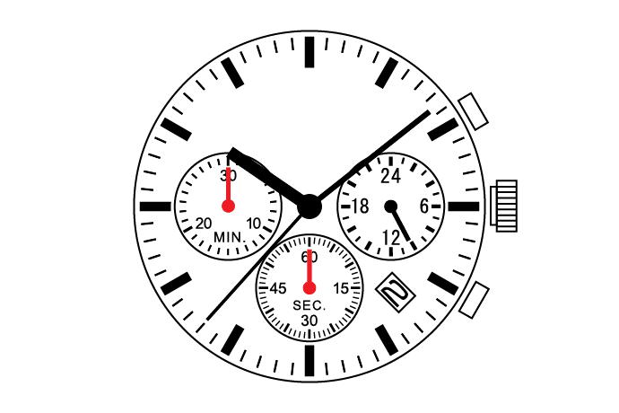

In my [last post](https://guillegran.github.io/blog/CechCohomology/cohomologyR.html) I mentioned that first Čech cohomology classes of a sheaf $\mathcal{G}$ of (maybe non-abelian) groups admit a geometric interpretation in terms of $\mathcal{G}$-torsors. In this post I am going to introduce the notion of a $\mathcal{G}$-torsor over a topological space $X$, and show how the set of equivalence classes of $\mathcal{G}$-torsors on $X$ can be identified with $H^1(X,\mathcal{G})$.

{#id .class width=50% height=50%}

# The action groupoid

Before I talk about torsors, let me introduce a very simple concept, but that will be very useful in this and other posts. Take any left action $G\times S\rightarrow S$ of a group $G$ on a set $S$. To this action we can associate its *action groupoid*, which is the category $[S,G]$ whose objects are precisely the elements of the set $S$ and, for every $x,y \in S$, the set of morphisms from $x$ to $y$ is

$$
\mathrm{Mor}_{[S,G]} (x,y)= \{g \in G: g\cdot x=y\}.
$$

This is clearly a groupoid since every morphism $g$ is an isomorphism, with inverse given by $g^{-1}$. The *moduli set* of this category (that is, its set of isomorphism classes)  is simply the set of orbits $S/G$.

In the last post we saw an example of a group action. Recall that for any open covering $\mathfrak{U}$ of a topological space $X$ and for any sheaf of groups $\mathcal{G}$ over $X$, we had that an action of $0$-cochains on $1$-cochains by "conjugation":

\begin{align*}
 C^0(\mathfrak{U},\mathcal{G}) \times C^1(\mathfrak{U},\mathcal{G})&\longrightarrow C^1(\mathfrak{U},\mathcal{G})\\ 
  ((f_U)_{U\in \mathfrak{U}}, (g_{UV})_{U<V \in \mathfrak{U}}) &\longmapsto (f_U g_{UV} f_V^{-1})_{U<V \in \mathfrak{U}}. 
  \end{align*}
  Moreover, we saw that this action respects cocycles.
Now, as in the last post, we can use refinement maps to define the sets $C^0(X,\mathcal{G})$, $C^1(X,\mathcal{G})$ and $Z^1(X,\mathcal{G})$ as limits by refinement. Suppose that we have some element of $Z^1(X,\mathcal{G})$ represented by a pair $(\mathfrak{U},g)$, with $g\in Z^1(\mathfrak{U},\mathcal{G})$ and some element of $C^0(X,\mathcal{G})$ represented by another pair $(\mathfrak{V},f)$. We can take a common refinement of both open covers by defining

$$
\mathfrak{W}=\{ U\cap V: U \in \mathfrak{U}, V \in \mathfrak{V} \}
$$

(which is of course an open cover, since every point is in some $U$ *and* in some $V$) with refinement maps given by

\begin{align*}
 \mathfrak{W}&\longrightarrow \mathfrak{U}\\ 
  U\cap V &\longmapsto U 
  \end{align*}
  (analogously for $\mathfrak{W} \rightarrow \mathfrak{V}$). Thus, for the previously chosen elements we can take representatives $g \in Z^1(\mathfrak{W},\mathcal{G})$ and $f \in C^0(\mathfrak{W},\mathcal{G})$ and define

$$
f \cdot g = (f_U g_{UV} f_V^{-1})_{U < V \in \mathfrak{W}}.
$$

In conclusion, we have just defined an action of the group $C^0(X,\mathcal{G})$ in the set $Z^1(X,\mathcal{G})$ (of course, in the same way we can define an action on $C^1$, but we are particularly interested in this one). Moreover, the good properties of the direct limit guarantee that the set of orbits is precisely $H^1(X,\mathcal{G})$.

We can now consider the action groupoid $[Z^1(X,\mathcal{G}),C^0(X,\mathcal{G})]$ associated to this action, whose moduli set is the Čech cohomology set $H^1(X,\mathcal{G})$. What we are going to do now is to give an interpretation of this action groupoid in terms of $\mathcal{G}$-torsors.

# Torsors
As above, let $X$ be a topological space and $\mathcal{G}$ a sheaf of groups over $X$.

**Definition 1.** A *$\mathcal{G}$-torsor* is a sheaf of sets $\mathcal{F}$ on $X$ endowed with an action $\mathcal{G} \times \mathcal{F} \rightarrow \mathcal{F}$ such that

  1. whenever $\mathcal{F}(U)$ is nonempty, the action  $\mathcal{G}(U) \times \mathcal{F}(U) \rightarrow \mathcal{F}(U)$ is [free and transitive](https://en.wikipedia.org/wiki/Group_action), and

  2. for every $x\in X$, the stalk $\mathcal{F}_x$ is nonempty.

A *morphism of $\mathcal{G}$-torsors* $\mathcal{F} \rightarrow \mathcal{F}'$ is simply a morphism of sheaves compatible with the $\mathcal{G}$-actions (we say that it is $\mathcal{G}$-equivariant).

More precisely, given a morphism of $\mathcal{G}$-torsors $\varphi:\mathcal{F} \rightarrow \mathcal{F}'$, being $\mathcal{G}$-equivariant means that, if $\mathcal{F}(U)$ is nonempty, for every $p\in \mathcal{F}(U)$ we have

$$
\varphi_U(g\cdot p)=g\cdot \varphi_U(p).
$$

The best way to unravel this definition is by looking at **examples**. The simplest example of a $\mathcal{G}$-torsor is the *trivial $\mathcal{G}$-torsor*, which is $\mathcal{F}=\mathcal{G}$ with the natural action given by the group operation. A key fact is now the following:

**Proposition 1.** *Let $\mathcal{F}$ be a $\mathcal{G}$-torsor. If $\mathcal{F}$ admits a global section, that is, if $\mathcal{F}(X)$ is nonempty, then it is isomorphic to the trivial $\mathcal{G}$-torsor.*

*Proof.* Choose $f\in \mathcal{F}(X)$. Since $f|_U \in \mathcal{F}(U)$ for every open subset $U\subset X$, the action $\mathcal{G}(U)\times \mathcal{F}(U) \rightarrow \mathcal{F}(U)$ is free and transitive. Therefore, every $h_U \in \mathcal{F}(U)$ can be written in a unique way as $h_U=g_U \cdot f|_U$, for $g_U \in \mathcal{G}(U)$. Thus, the map

\begin{align*}
 \mathcal{F}(U)&\longrightarrow \mathcal{G}(U)\\ 
  h_U &\longmapsto g_U, 
  \end{align*}

  which is clearly equivariant, defines a sheaf isomorphism. $\blacksquare$

Note now that since for every $x\in X$, we have that $\mathcal{F}_x \neq \varnothing$, there is an open cover $\mathfrak{U}$ of $X$ such that, for every $U\in \mathfrak{U}$, the set $\mathcal{F}(U)$ is nonempty. Therefore, on every $U \in \mathfrak{U}$, the sheaf $\mathcal{F}|_U$ is isomorphic to the trivial $\mathcal{G}|_U$-torsor. In conclusion, what property 2 in the definition of $\mathcal{G}$-torsor actually means is that every $\mathcal{G}$-torsor is, in some way, "locally trivial". The open cover $\mathfrak{U}$ is called a *trivializing cover*.

There are other examples of of $\mathcal{G}$-torsors that the reader could be familiar with. To introduce these examples, first consider a topological group $G$. Associated to this group we can define two different sheaves. One is the *sheaf of $G$-valued functions*, which we denote simply by $G$, and is defined by

$$
G(U)= \{ \text{Continuous maps } U\rightarrow G \}.
$$

The other one is the *sheaf of **locally constant** $G$-valued functions*, denoted by $\underline{G}$, and defined by

$$
\underline{G}(U)= \{ \text{Continuous maps } U\rightarrow G \text{ that are locally constant} \}.
$$
Note that these two sheaves are essentially different, although they coincide if the group $G$ is endowed with the discrete topology. Now, $G$-torsors are best known as *principal $G$-bundles* (or rather, as their sheaves of sections). On the other hand $\underline{G}$-torsors can be identified with *$G$-covering spaces*. I will say a lot about these two examples in future posts. If the reader is familiar with principal bundles, maybe it is useful for them to think of a $\mathcal{G}$-torsor as a generalization of a principal bundle in the sense that the structure group depends continuously on the base point.

Now, let us see how there is a groupoid naturally associated with $\mathcal{G}$-torsors:

**Proposition 2.** *Every morphism of $\mathcal{G}$-torsors is an isomorphism.*

*Proof.* Consider $\varphi:\mathcal{F} \rightarrow \mathcal{F}'$ a morhpism of $\mathcal{G}$-torsors. First, we will see that the map is injective. Suppose that there are $p_1,p_2 \in \mathcal{F}(U)$ such that $\varphi_U(p_1)=\varphi_U(p_2)$. Since the action on $\mathcal{F}(U)$ is transitive and free, there exists a unique $g \in \mathcal{G}(U)$ such that $p_1=g\cdot p_2$ and, since $\varphi$ is equivariant, $\varphi_U(p_1)=g\cdot \varphi_U(p_2)$. But the group $\mathcal{G}(U)$ also acts freely and transitively on $\mathcal{F}'(U)$, so $g=1$ and $p_1=p_2$. On the other hand, to see that it is surjective take any element $p\in \mathcal{F}(U)$. Since the action is transitive we can write any other element $p'\in \mathcal{F}(U)$ as $p'=g\cdot \varphi_U(p)$, for some $g\in \mathcal{G}(U)$. Therefore, since $\varphi$ is equivariant, $p'=\varphi_U(g\cdot p)$. $\blacksquare$

What we have just shown is that if we consider the category whose objects are $\mathcal{G}$-torsors and whose morphisms are morphisms of $\mathcal{G}$-torsors, this category is in fact a groupoid. The main purpose of this post is to show that this groupoid is equivalent to the action groupoid $[Z^1(X,\mathcal{G}),C^0(X,\mathcal{G})]$. In particular, this equivalence will yield a bijective correspondence between isomorphism classes of $\mathcal{G}$-torsors and cohomology classes in $H^1(X,\mathcal{G})$.

# Transition functions
The way to obtain a Čech cocycle from a $\mathcal{G}$-torsor is by considering *transition functions*. Consider a $\mathcal{G}$-torsor $\mathcal{F}$ and a trivializing cover $\mathfrak{U}$ of $\mathcal{F}$. Now, pick a section $s_U \in \mathcal{F}(U)$ on each $U\in \mathfrak{U}$ (I guess you need to use the Axiom of Choice here, but who cares --besides, we already used it to define cochains--). Now, for every two open sets $U,V \in \mathfrak{U}$, since the action of $\mathcal{G}(U\cap V)$ on $\mathcal{F}(U\cap V)$ is transitive, there must exist some cochain $g=(g_{UV})_{U<V \in \mathfrak{U}} \in C^1(\mathfrak{U},\mathcal{G})$ such that 

$$
s_U|_{U\cap V} = g_{UV} s_V|_{U \cap V}.
$$

Moreover, this cochain is a cocycle since

$$
g_{UV}g_{VW} s_W = g_{UV} s_V = s_U = g_{UW} s_W.
$$

Thus, to any $\mathcal{G}$ torsor $\mathcal{F}$ we can associate a cocycle $g\in Z^1(\mathfrak{U},\mathcal{G})$ for some open cover $\mathfrak{U}$ of $X$. This cocycle is called a *set of transition functions* of $\mathcal{F}$.

The choice of transition functions is not canonical, since it depends on the choice of the sections $s_U$. However, if we pick other sections $s'_U \in \mathcal{F}(U)$ on each $U\in \mathfrak{U}$, since the action is transitive, we can write each $s'_U$ as $s'_U=f_U s_U$, for some $f_U \in \mathcal{G}(U)$. Therefore, if we consider the cocycle $g'$ defined by $s'_U=g'_{UV} s'_V$, we have

$$
f_U s_U = s'_U = g'_{UV} s'_V = g'_{UV} f_V s_V,
$$

so $g'_{UV} = f_U g_{UV} f_V^{-1}$. The same argument shows that if $\varphi:\mathcal{F} \rightarrow \mathcal{F}'$ is a morphism of $\mathcal{G}$-torsors, and given a choice of the $s_U$ and thus of the cocycle $g$, this cocycle and the cocycle $g'$ determined by the $\varphi_U(s_U)$ are related by a cochain $f\in C^0(\mathfrak{U},\mathcal{F})$ in the same way, $g'_{UV}=f_U g_{UV} f_V^{-1}$.

By choosing a trivializing cover for any $\mathcal{G}$-torsor and a set of transition functions, after taking the equivalence class in the direct limit we can define a morphism of groupoids by the following functor

\begin{align*}
 \{\text{$\mathcal{G}$-torsors} \} &\longrightarrow [Z^1(X,\mathcal{G}),C^0(X,\mathcal{G})]\\ 
  \mathcal{F} &\longmapsto \{ \text{Transition functions of $\mathcal{F}$} \},
  \end{align*}
  which maps any morphism of $\mathcal{G}$-torsors to the $0$-cochain defined above.

**Proposition 3.** *This functor is an equivalence of categories. In particular, the set $H^1(X,\mathcal{G})$ classifies isomorphism classes of $\mathcal{G}$-torsors.*

*Proof.* Clearly, the functor is fully faithful since the choice of open covering $\mathfrak{U}$ and of $f_U \in \mathcal{G}(U)$, for $U\in \mathfrak{U}$ determines $\varphi$ as $\varphi_U(s_U)=f_U s_U$, for $s_U \in \mathcal{F}(U)$. Thus, it suffices to see that the functor is essentially surjective. This means that what we have to show is that given a cocycle in $Z^1(X,\mathcal{G})$, we can construct a $\mathcal{G}$-torsor whose transition functions are given by this cocycle. The way of doing this is a standard procedure which appears in a lot of places. The idea is to define the torsor locally as $\mathcal{G}$ and then use the cocycle to "glue" the different patches. More precisely, we choose a representative $(\mathfrak{U},g)$, with $g\in Z^1(\mathfrak{U},\mathcal{G})$, of the chosen cocycle and define a presheaf

$$
\mathcal{F}(U)= \coprod_{V \in \mathfrak{U}} \mathcal{G}(U\cap V)/\sim,
$$
with the equivalence relation $\sim$ given as follows. We say that two sections $f\in \mathcal{G}(U\cap V)$ and $f'\in \mathcal{G}(U\cap V')$, with $V\cap V'\neq \varnothing$, are related if 

$$
f|_{U\cap V \cap V'} = g_{VV'} f'|_{U\cap V \cap V'}.
$$

This presheaf verifies the sheaf condition by construction and it is a $\mathcal{G}$-torsor since on every $U\in \mathfrak{U}$ it is the trivial $\mathcal{G}$-torsor. Again by construction, the cocycle $g$ gives the transition functions of $\mathcal{F}$. $\blacksquare$

# A nice application
For the well known cases associated to $G$ topological group, the above result is telling us that (isomorphism classes of) prinicipal $G$-bundles are classified by the cohomology set $H^1(X,G)$ and that $G$-covering spaces are classified by $H^1(X,\underline{G})$.

In a future post, I will explain how the correspondence between $G$-covering spaces and $H^1(X,\underline{G})$ gives a nice and maybe "non-standard" approach at the basic results of Algebraic Topology. As for now, I am going to show how the correspondence between principal $G$-bundles and $H^1(X,G)$ can be combined with the results of my [last post](https://guillegran.github.io/blog/CechCohomology/cohomologyR.html) to prove a nice fact of principal bundle theory.

What we are going to consider now is the problem of lifting the structure group to a group extension. In general, for any group $G$ we say that another group $\hat{G}$ is an *extension* of $G$ if there is a surjective homomorphism $\hat{G} \rightarrow G$. More generally, if $1\rightarrow A \rightarrow \hat{G} \rightarrow G \rightarrow 1$ is a short exact sequence of groups, we say that $\hat{G}$ is an *extension of $G$ by $A$*. Moreover, if the homomorphism $A \rightarrow \hat{G}$ factors through the centre of $\hat{G}$, we say that the extension $\hat{G}$ is a *central extension*. In particular, if $\hat{G}$ is a central extension, the group $A$ is abelian.

The lifting problem consists on, given a central extension $1\rightarrow A \rightarrow \hat{G} \rightarrow G \rightarrow 1$ and a principal $G$-bundle $E$ over a topological space $X$, constructing a principal $\hat{G}$-bundle $\hat{E}$ "lifting" $E$. In our terms, we can regard $\hat{G} \rightarrow G$ as a morphism of sheaves, that induces a map $H^1(X,\hat{G}) \rightarrow H^1(X,G)$. What we want to know is when this map is surjective. 
Recall now from my last post that, since $A$ is abelian, $H^2(X,A)$ is defined and the short exact sequence $1\rightarrow A \rightarrow \hat{G} \rightarrow G \rightarrow 1$ induces in cohomology the exact sequence

$$
H^1(X,\hat{G}) \rightarrow H^1(X,G) \rightarrow H^2(X,A).
$$
Therefore, the map $H^1(X,\hat{G}) \rightarrow H^1(X,G)$ is surjective if and only if $H^2(X,A)$ is trivial.

**Example.** A nice example where this lifting problem is interesting is given by spin structures. Let $X$ be an $n$-dimensional Riemannian manifold. Its tangent bundle $TX$ is a vector bundle and, by considering its [*frame bundle*](https://en.wikipedia.org/wiki/Frame_bundle) we can regard it as a principal $\mathrm{GL}(n,\mathbb{R})$-bundle. Now, the Riemannian metric gives a reduction of the structure group to a principal $\mathrm{SO}(n)$-bundle. A *spin structure* on $X$ is a lift of the structure group from this principal $\mathrm{SO}(n)$-bundle to the universal covering space $\mathrm{Spin}(n) \rightarrow \mathrm{SO}(n)$. It is well known that $\mathrm{SO}(n)$ is doubly connected. For example, $\mathrm{SO}(3)$ is diffeomorphic to the real projective space $\mathbb{RP}^3$ and $\mathrm{Spin}(3)=\mathrm{SU}(2)$ is diffeomorphic to the $3$-sphere $\mathbb{S}^3$. Therefore, the covering homomorphism $\mathrm{Spin}(n) \rightarrow \mathrm{SO}(n)$ is in fact a central extension

$$
1 \rightarrow \mathbb{Z}/(2) \rightarrow \mathrm{Spin}(n) \rightarrow \mathrm{SO}(n) \rightarrow 1.
$$

We conclude from this that the obstruction for defining spin structures n $X$ will be given by its Čech cohomology set $H^2(X,\mathbb{Z}/(2))$. If $g\in H^1(X,\mathrm{SO}(n))$ denotes the cocycle associated to the tangent bundle, the element $\delta(g) \in H^2(X,\mathbb{Z}/(2))$ is called the *second Stiefel-Whitney class* of $X$, denoted $\omega_2(X)$. We will be able to define a spin structure on $X$ whenever this class vanishes, $\omega_2(X)=0$.

------

[Read it in PDF](torsors.pdf)

[Take me to the blog index](https://guillegran.github.io/blog/indice.html)

[Take me home](https://guillegran.github.io)

