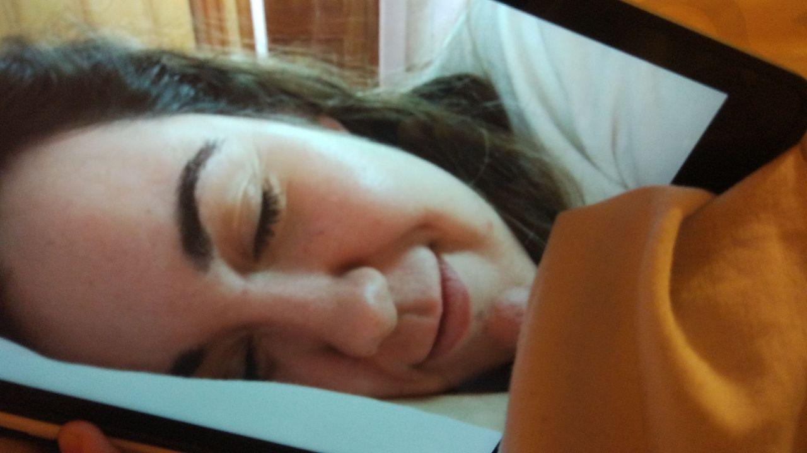
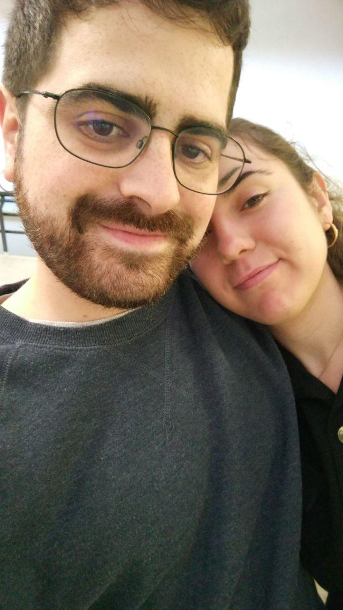
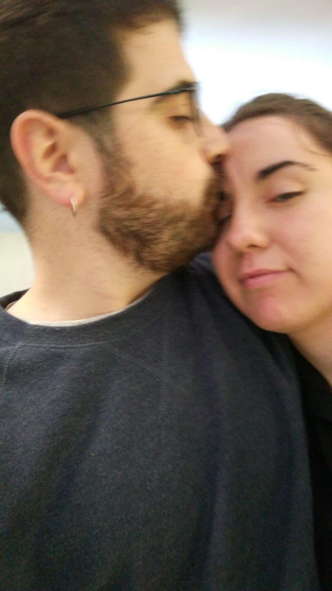
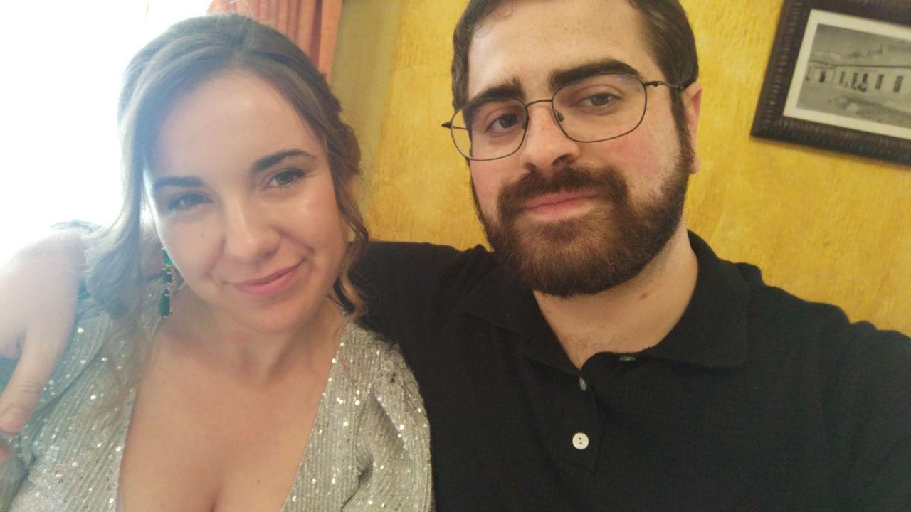
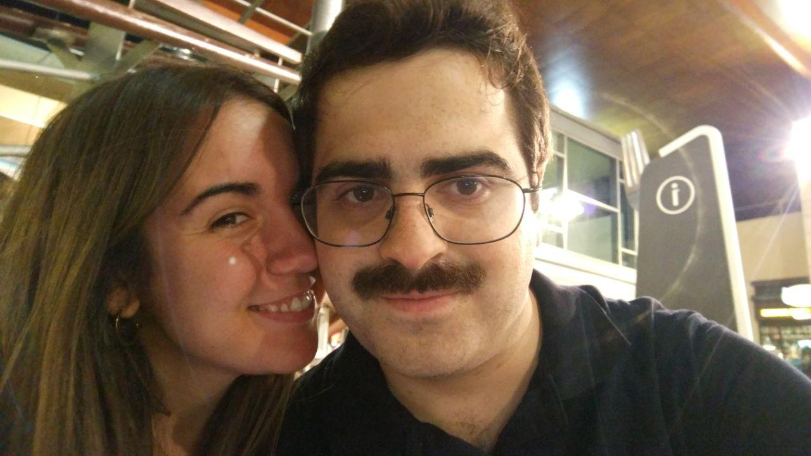
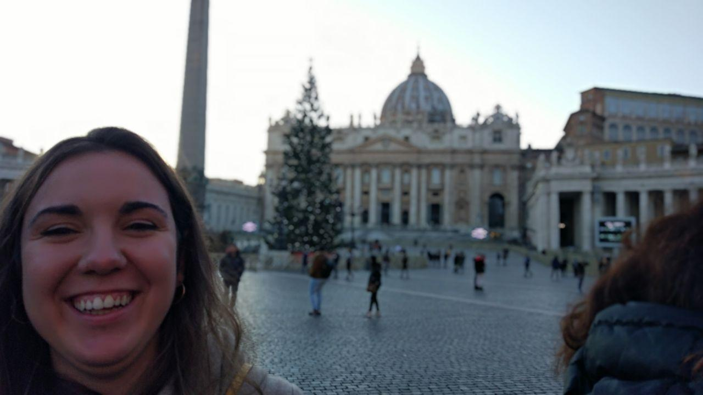
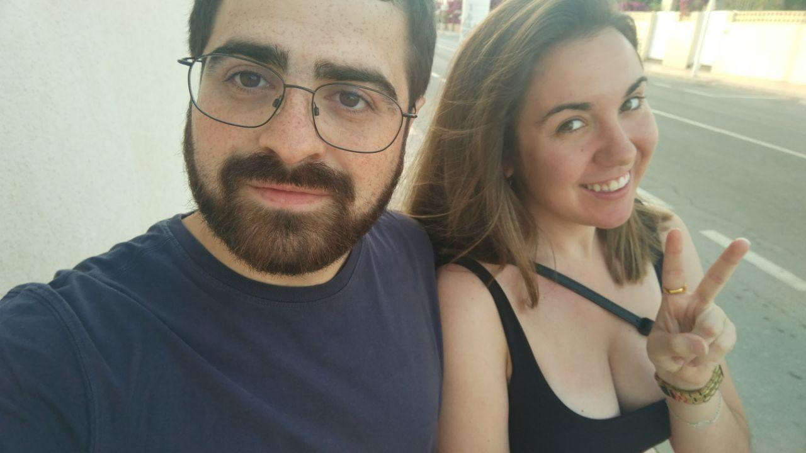
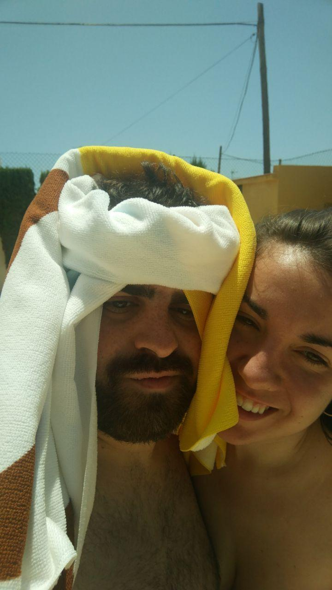
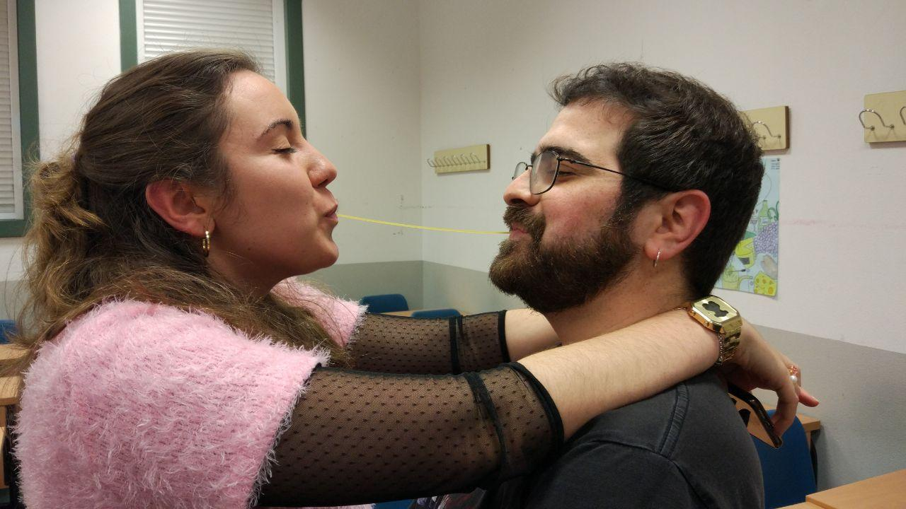
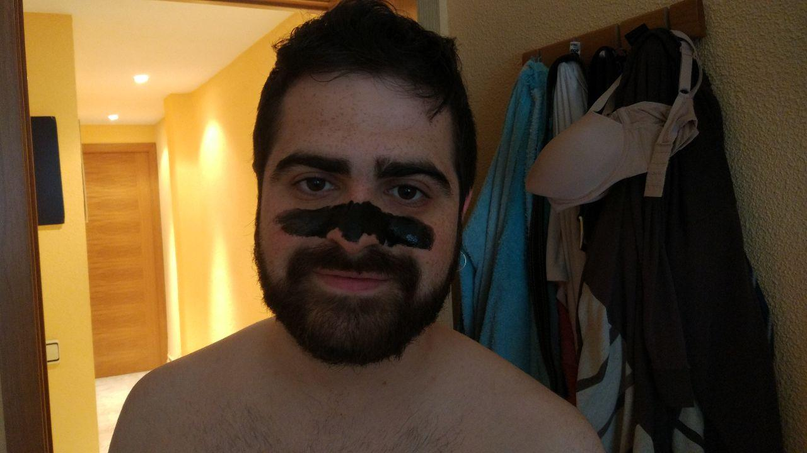

Querida Laura,

Desde que llegaste a mi vida has alumbrado mi existencia como un sol y me has regalado innumerables momentos de felicidad.

Hoy, te haces un año mayor, y será otro año de tu vida que seguiré a tu lado, volcándote todo mi amor y ofreciéndote todo lo que tengo y todo lo que soy.

Desgraciadamente, este año, nos ha tocado celebrarlo en la distancia, y regalarnos todo nuestro amor a través de medios digitales.

Sé que estos momentos están siendo muy difíciles para ti y, aunque sé que tú eres una valiente luchadora que no se rinde bajo ningún concepto, sé que ahora más que nunca necesitas a tu lado a un Guillermín que te cuide y que te quiera.

Por eso, quiero que sepas que pase lo que pase podrás contar conmigo...

...tanto cuando estés pachuchita

... como cuando te sientas como una auténtica Reina (que lo eres).

Dentro de muy poco tendrás que volver a aguantar mis horripilantes cambios de look y decisiones estilísticas...

... pero también podremos volver a tener una noche romántica por el centro de Madrid.

(En esta sales más guapa).

Dentro de poco, podremos volver a viajar juntos por el mundo.

Aunque este verano mejor hacemos turismo nacional...

... y tendrás que volver a verme hacer el tonto en la piscina.

Y, por supuesto, celebraremos este día tan especial como se merece, en tu restaurante favorito.

No te quepa duda, comiendo juntos unos deliciosos espaguetis.

En cualquier caso, para que no te aburras y se te haga más llevadero el tiempo hasta que nos veamos, aquí puedes disfrutar de tu [regalo](regalo.html).

De tu cachorrito, que te quiere con locura.

TE AMO, cariño.

Que tengas un muy **feliz cumpleaños**.
