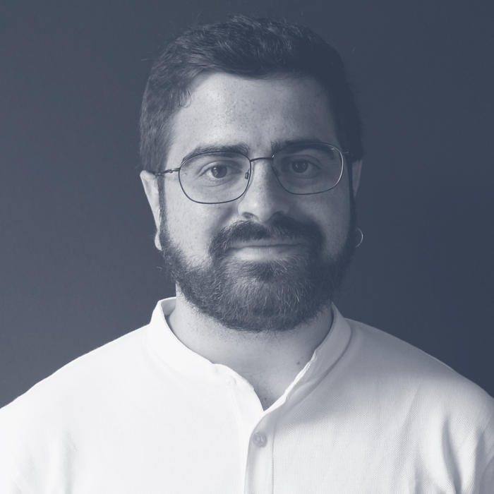

Mi nombre es Guillermo Gallego Sánchez. Sed bienvenidos a mi portafolio de aprendizaje digital, donde recojo parte de mis experiencias y reflexiones relacionadas con la asignatura *Aprendizaje y desarrollo de la personalidad* del Máster de Formación del Profesorado de Educación Secundaria en la Universidad Complutense.

Mi página web: [guillegran.github.io](http://guillegran.github.io)

## Mi experiencia académica
Terminé el Bachillerato científico en el IES La Sisla de Sonseca en 2013 y comencé los estudios de Matemáticas y Física en la Universidad Complutense en 2013. Me gradué en 2018 y en el curso académico 2018-2019 estudié el Máster en Matemáticas Avanzadas, también en la Complutense. Actualmente estoy cursando los estudios de Doctorado en Investigación Matemática en la Complutense, que compagino con el Máster de Formación del Profesorado.

## Mi experiencia laboral
En cuanto a mi trayectoria profesional, principalmente he trabajado como profesor. Durante la carrera y antes de ésta he impartido numerosas clases particulares de Matemáticas, Física y Química y también he impartido cursos de verano de Matemáticas a alumnos de ESO en el Centro de Juventud de Sonseca, mi pueblo.

Mi trabajo más importante fue en el verano de 2019, durante el cual impartí un *bootcamp* de 432 horas de *Data Science*, en la academia [NEOLAND](https://www.neoland.es/data-science-bootcamp).

## Mis expectativas sobre el máster y sobre la asignatura

### ¿Por qué he elegido estudiar el MFPES?
El Máster de Formación del Profesorado es un máster habilitante, es decir, es un requisito indispensable para poder presentarse a la oposición  o incluso para trabajar como profesor de instituto. Por otra parte, concretamente la especialidad de Matemáticas tiene numerosas plazas disponibles, lo que quiere decir que es una opción de trabajo bastante segura. Por el momento, no tengo intención de trabajar como profesor o de opositar, pero es un buen plan secundario por si las cosas no van bien en la carrera investigadora. El trabajo de profesor tiene más vacaciones y permite una mejor conciliación que otros trabajos disponibles para personas con mi perfil.

En cualquier caso, esto no quiere decir que a mí la educación no me importe, o me pille de rebote. Me considero una persona con una fuerte vocación didáctica y me preocupo realmente por los temas educativos, lo que ha sido una gran motivación para hacer este máster. No lo estaría haciendo si no pensara que valgo para ello.

### ¿Cuáles son mis expectativas?
Siendo sincero, ningunas. Todo lo que aprenda será bien recibido y, a su vez, inesperado.

### ¿Qué creo que puedo aportar?
Varias cosas:

+ Un perfil más joven y cercano. Considero que soy alguien que comprende la mayoría de las motivaciones y gustos de los adolescentes, de forma que puedo comunicarme con ellos de forma más cercana, entenderles mejor y, en resumen, llevarme mejor con ellos que alguien de mayor edad, que estuvo en su posición muchos años antes.

+ Innovaciones educativas. Tengo buenos conociemientos de informática y estoy al tanto de sus avances y de sus aplicaciones a la didáctica de las matemáticas. Puedo discernir qué herramientas tecnológicas son mejores para labor docente y diseñar materiales para enseñar ciertos conceptos.

+ Conocimiento científico riguroso. Debido a que trabajo como matemático, tengo un verdadero dominio de la asignatura, al menos a niveles como los del bachillerato, lo que me permite transmitir a los alumnos una formación correcta y rigurosa, poder atacar los problemas desde diferentes enfoques y entender los obstáculos didácticos a los que se enfrentan los alumnos desde un punto de vista superior.
