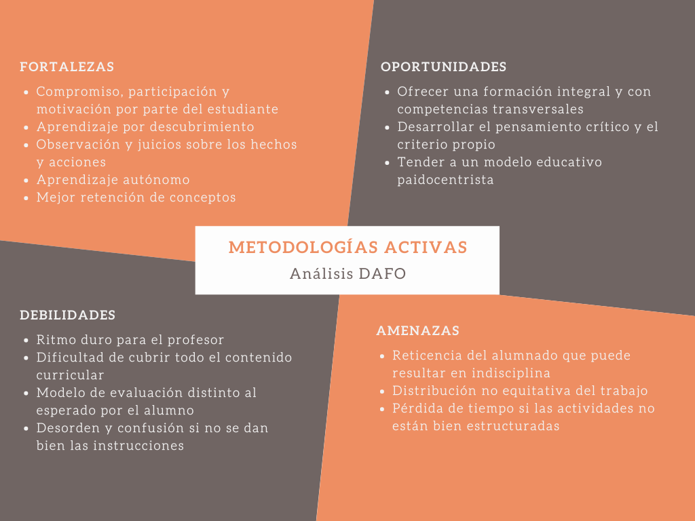

## ¿Qué son las metodologías activas?
Las metodologías activas son procesos de aprendizaje opuestos a los métodos pasivos usados tradicionalmente en la enseñanza. Se caracterizan por ser participativos y autodirigidos, es decir, se otorga al estudiante la capacidad de juzgar y evaluar su aprendizaje. Se intenta además plantear problemas cercanos al contexto real práctico del estudiante.

## Análisis DAFO 

