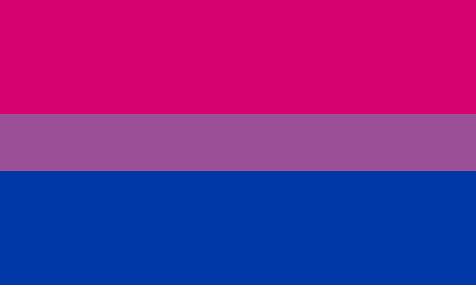

Se presenta a continuación un breve resumen/taxonomía de las diferentes identidades que comprenden el colectivo LGTB. Creo que es importante que un profesor de secundaria esté familiarizado con esta terminología y estas identidades, de cara a poder hacer un tratamiento razonable de atención a la diversidad. Las opiniones o posturas que cada uno tenga al respecto son independientes.

## Homosexualidad
En general, se entiende por *homosexualidad* la atracción sexual entre individuos del mismo sexo o género.

### Símbolos
El símbolo que más representa a la comunidad homosexual es la bandera arcoiris, usada especialmente como apoyo al "Orgullo Gay". A veces se entiende que esta bandera representa exclusivamente a los hombres homosexuales. Existe cierta diversidad de opiniones acerca de qué símbolo representa a las mujeres lesbianas, a parte de la bandera arcoiris existen otros símbolos como la bandera "lipstick" o el triángulo invertido negro (usado por los nazis para identificar a las lesbianas en los campos de concentración, de forma similar a cómo el triángulo invertido rojo identificaba a los comunistas).

### Homofobia
A día de hoy, dentro del espectro LGTB la homosexualidad (especialmente en varones) es la orientación que goza de mayor aceptación y menor discriminación social, al menos en España, aunque en absoluto sigue estando totalmente normalizada. La homosexualidad sigue siendo un delito en muchos países del mundo e incluso en países donde está despenalizada son habituales las agresiones e incluso los asesinatos a población homosexual.

En el siguiente mapa de Wikipedia puede verse un resumen de la situación de las leyes sobre homosexualidad en todo el mundo. [Pinchar en la imagen para ver la leyenda del mapa].

## Pero, exactamente, ¿qué es el género?

Para multitud de filósofos, psicólogos, sociólogos, antropólogos y demás, el género no es un fenómeno que pueda reducirse al sexo "biológico" o a los genitales. Así, nacen los estudios de género, un campo interdisciplinario que podríamos decir que toma como punto de partida la frase de Simone de Beauvoir: "No se nace mujer, sino que se llega a serlo". 

Sin embargo los estudios de género no son en absoluto una disciplina única, sino que existen multitud de teorías con visiones diferentes y opuestas entre ellas. Del mismo modo, no hay un solo feminismo, sino que hay muchas corrientes feministas enfrentadas entre sí. Estos enfrentamientos no son en absoluto despreciables, sino que se trata de corrientes con programas totalmente opuestos, como puedan ser los del feminismo liberal y los del feminismo radical o incluso los del "feminismo marxista" (si es que tal cosa puede existir). Como ejemplo de esta no-unicidad del movimiento feminista basta estudiar el término [TERF](http://en.wikipedia.org/wiki/TERF) (*trans-exclusionary radical feminist*), utilizado por ciertas corrientes del feminismo para señalar a las feministas radicales que no consideran que las *mujeres trans* sean verdaderas mujeres (volveremos sobre esto en el apartado sobre *Transfobia*).

Vemos por tanto que existe una verdadera discusión y una gran variedad de teorías respecto a qué es el género. Dentro de estas teorías hay quien defiende que el género es algo "esencial" o "innato" (estas serían las *teorías esencialistas*) mientras que otros defienden que es un *constructo social*. Así, en particular, autores como [Judith Butler](http://en.wikipedia.org/wiki/Performativity), partidarios de la *teoría queer*, defienden que el género no es innato sino que se construye a través de acciones "[*performativas*](http://en.wikipedia.org/wiki/Performativity)". 
Es importante por tanto desde el punto de vista de la teoría queer el concepto de *identidad de género*, es decir, el sentimiento personal del género de uno mismo. 

Será precisamente el concepto de identidad de género el que usemos en la práctica a la hora de estudiar y clasificar las distintas categorías del colectivo LGTB. Es decir, no nos va a interesar tanto lo que el individuo en cuestión *es o deja de ser* sino más bien *cómo se identifica*.

## Transgénero

Se entiende por *transgénero* a aquella persona cuya identidad de género es distinta del sexo que se le asignó al nacer (que generalmente, aunque no siempre, coincide con su sexo "biológico" o, al menos, con el asociado a sus genitales). Algunas personas transgénero, aunque no todas, deciden *transicionar*, esto es, en cierto modo "cambiar" o "adaptar" su aparencia y comportamiento del que culturalmente está asociado a su sexo asignado al nacer al que está asociado a su identidad de género. Por ejemplo, una persona cuya identidad de género es la de una mujer, pero al nacer se le asignó el género masculino (lo que se conoce como una *mujer trans*), que siempre se haya vestido "como un hombre" y que empiece a vestirse "como una mujer".

Dentro del proceso de transición algunas personas deciden someterse a terapias de *reasignación sexual* que pueden incluir tratamiento con hormonas o cirugías (por ejemplo, implantes mamarios o una vaginoplastia). Las personas transgénero que han sido sometidas a este tipo de tratamiento se denominan *transexuales*. Por tanto, es importante no confundir los términos y entender que *transexual* es un subconjunto de *transgénero*. En general, suele usarse el término, menos equívoco de *personas trans*, para referirse a todo al colectivo transgénero.

En materia de derechos, las personas trans, tal y como se señala en el informe de Grant, Mottet y Tanis (2019) (centrado en Estados Unidos), aún deben enfrentar grandes situaciones de discriminación, especialmente agravadas (en el caso de Estados Unidos) para las personas trans negras. Son especialmente alarmantes las elevadas cifras de pobreza extrema y las tasas de intento de suicidio entre estas personas.

](suicidiotrans.jpg) 

### Debate sobre el DSM
La quinta edición del *Manual diagnóstico y estadístico de los transtornos mentales* (abreviado como DSM-5), la herramienta con mayor autoridad en la clasificación y el diagnóstico psiquiátrico, incluye la disforia de género como un transtorno mental. Esto ha generado cierto debate entre dos posturas contrapuestas: la que defiende esta inclusión porque piensa que así se garantiza el acceso a la terapia hormonal y quirúrgica, y la que la critica porque cree que contribuye a la estigmatización de las personas trans.

### Géneros no-binarios
El espectro de la identidad de género no-binaria o "espectro *genderqueer*" es un conjunto de identidades de género no exclusivamente masculinas o femeninas. En principio las personas con identidad de género no-binaria pueden considerarse transgénero en tanto que en general no se asignan géneros no-binarios al nacer, con excepción tal vez de las personas [*intersexuales*](https://en.wikipedia.org/wiki/Intersex), cuyo sexo "biológico" es realmente no-binario, por alteraciones cromosómicas o en las hormonas y genitales, aunque también en general se les asigna un género al nacer. Dentro del espectro no-binario están las personas *de género fluido* (en inglés, *genderfluid*), que prefieren permanecer flexibles o indefinidos respecto a su identidad de género.

## ¿Bisexualidad o pansexualidad?

Se entiende por bisexual a aquella persona que siente atracción sexual hacia hombres y mujeres, o más bien, hacia personas de cualquier género o identidad de género. Por otra parte en tiempos recientes ciertas personas se han sentido identificadas con el término *pansexual*, en principio definido como «atracción sexual hacia otras personas independientemente de su género». 

A priori, ambos términos parecen definir lo mismo, y de hecho lo hacen, a pesar de las piruetas dialécticas que den ciertos individuos. Por ejemplo, hay quien argumenta que la bisexualidad no incluye la atracción por personas trans, lo cual es totalmente falso, pues en principio incluso una persona heterosexual puede sentir atracción por una persona transexual sin dejar de ser heterosexual. 

¿Por qué usar entonces el término «pansexual»? Principalmente, el mayor argumento razonable a favor de este término es que la palabra «bisexual» en cierto modo invisibiliza a las personas no-binarias. Por otra parte, una de las reivindicaciones de las personas bisexuales es que se las invisibiliza, ya que se las trata como heterosexuales u homosexuales o como que alternan entre ambas identidades. Es decir, consideran que ya bastante invisibilizada y poco comprendida está ya la bisexualidad como para complicarla con nuevos términos.

## Asexualidad
Se entiende por *asexualidad* la falta de atracción sexual hacia otros y no debe ser confundida con la abstinencia sexual o el celibato. Más aún, se defiende la existencia de un "espectro *ace*" o gris-asexualidad formado por individuos no "absolutamente asexuales" sino que pueden sentir atracción en ciertas ocasiones. Entre las reivindicaciones de las personas asexuales están, a parte de la comprensión de su identidad, su despatologización, es decir, que la asexualidad deje de ser considerada un transtorno y se entienda como una genuina orientación sexual.

Explicaciones sencillas y un torrente de información recopilada pueden verse en el siguiente vídeo de Ernesto Castro.

## Referencias
Grant, J. M., Mottet, L. A. y Tanis, J. (2019). *Injustice at every turn: A report of the national transgender discrimination survey*. National Center for Transgender Equality. 
