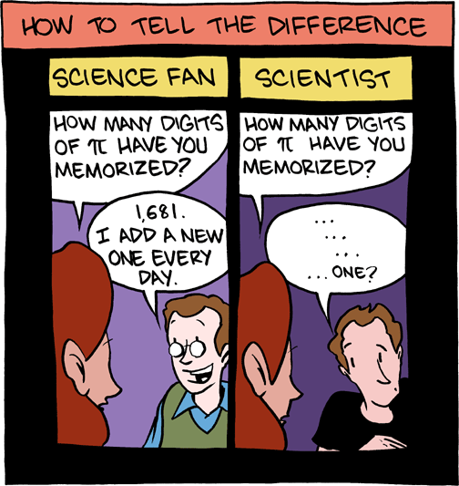

## Un nuevo paradigma educativo

En 1965, Gordon Earl Moore, uno de los fundadores de Intel, formuló una [famosa ley](http://es.wikipedia.org/wiki/Ley_de_Moore) que afirma que cada dos años se duplica el número de transistores en un microprocesador. Esta ley sigue vigente en la actualidad. A su vez, el crecimiento de la capacidad de almacenamiento, comunicación y computación de la información ha seguido una ley similar (Hilbert-López, 2011).

No cabe duda de que esta "Revolución Digital" ha traído consigo subsecuentes cambios en la Educación, es decir, en cómo el conocimiento se transmite. La abundancia de grandes repositorios de información en Internet, tanto "legales" como "ilegales" ha facilitado el acceso gratuito a información de calidad a estudiantes de cualquier lugar del globo. También se han generado ingentes cantidades de material educativo audiovisual, tanto en los canales del "Youtube Educativo" (con los famosos "profesores *youtubers*" y divulgadores científicos, como David Calle, Crespo, o 3Blue1Brown), como en los famosos MOOC (*massive open online course*), algunos distribuidos por instituciones tan prestigiosas como Stanford o el MIT.

## ¿Como enseñar en este nuevo mundo?

La tecnología, lejos de resolver todos los problemas del aprendizaje, genera otros nuevos. No es poco frecuente (especialmente en los primeros cursos de las carreras de ciencias) el perfil del estudiante curioso que ha invertido innumerables horas en visualizar todos los vídeos de divulgación científica en Youtube, e incluso algunos con contenido científico *real*, es decir, con contenidos académicos como los de 3Blue1Brown; y, aún "conociendo" en muchos casos la teoría (pues la ha visto en estos vídeos) es incapaz de tener éxito ni en sus asignaturas más fáciles. Este fenómeno se produce porque el empaquetamiento de contenidos profundos en cápsulas tan diminutas hace que, aunque se dé una presentación comprensiva, el alumno no obtenga un conocimiento profundo de la asignatura, ya que es necesario que sea él mismo el que participe en el proceso de construcción de ésta. En cierto modo, los vídeos de Youtube vienen a sustituir a las clases magistrales.

Entonces, ¿cómo enseñamos? Precisamente este nuevo paradigma, al menos para la educación universitaria, lo que sugiere es un modelo esencialmente no presencial en el que los estudiantes puedan tranquilamente consumir las "clases magistrales" desde casa y en el resto de horas trabajen los problemas, cuyas dudas podrán resolverles los profesores en amplios horarios de tutoría. Por supuesto este modelo es aparentemente incompatible con la educación secundaria tal y como está planteada en la actualidad, cuyo precepto supremo, por encima de que los alumnos aprendan alguna cosa, es que estén recluidos hasta que cumplan los 16 años y se les pueda soltar en un mundo totalmente desconocido para ellos.

## Divulgación, vulgarización y pseudociencia

Muy unidos a los canales de enseñanza de los "profesores *youtubers*" están los canales de divulgación científica. Estos canales en principio no pretenden transmitir un conocimiento puramente académico como pueda ser el que se transmite en los vídeos de David Calle sino que, tratando de ser lo más exacto posible, se intenta dar a conocer al público general los rasgos o ideas principales de ciertas teorías o estudios científicos. Este es por supuesto un trabajo de gran dificultad y en ocasiones incluso imposible, ya que muchos conocimientos científicos requieren años de especialización y profundización para siquiera raspar la superficie de su significado. 

Contrapuesta a la divulgación, aunque en muchas ocasiones confundida con ésta, está la vulgarización científica. Los vulgarizadores científicos normalmente no son científicos, sino que son "fans de las ciencias", es decir, interesados provenientes de otras áreas, como por ejemplo periodistas. Lo que caracteriza a los vulgarizadores científicos es que, bajo el paragüas de una supuesta "ciencia" y no necesariamente a mala fe, divulgan especulaciones o divagaciones, que son esencialmente de carácter filosófico (pero de una filosofía de muy baja estofa). Un gran ejemplo de vulgarizador científico es el *youtuber* español [CdeCiencia](http://www.youtube.com/channel/UC52hytXteCKmuOzMViTK8_w), por ejemplo en sus vídeos sobre ["El sueño interestelar"](https://www.youtube.com/watch?v=DBwfSDVXTI4).

Y, por supuesto, en el escalafón más bajo de los niveles de vergüenza están aquellos *youtubers* e *influencers* que directamente se dedican a propagar teorías pseudocientíficas y, lo que es peor, lucrarse a base de patrocinar y vender productos pseudocientíficos. Huelga mencionar ya la estafa de los ["cursos de motivación" de JPelirrojo](https://www.publico.es/tremending/2019/09/21/las-redes-tachan-al-youtuber-jpelirrojo-de-timador-tras-ofrecer-cursos-de-motivacion-por-mas-de-3-000-euros/).

## Conclusión
La sociedad se encuentra ante una paradoja: a pesar de que toda la información útil está a libre disposición, ésta se encuentra sepultada entre cantidades abrumadoras de ruido e información basura. Una sociedad educada no es capaz de separar el grano de la paja, de modo que su aparente aliado se convierte en su peor enemigo. Citando al filósofo [Gustavo Bueno](https://www.youtube.com/watch?v=r6bMijQWAuQ) cuando le preguntaron acerca de la censura durante el franquismo: "un libro de álgebra superior es un libro clandestino aunque se deje en mitad de la calle, porque la gente no lo entiende".

## Referencia
Hilbert, M. y López, P. (2011) The world's technological capacity to store, communicate and compute information. *Science, 332*.
